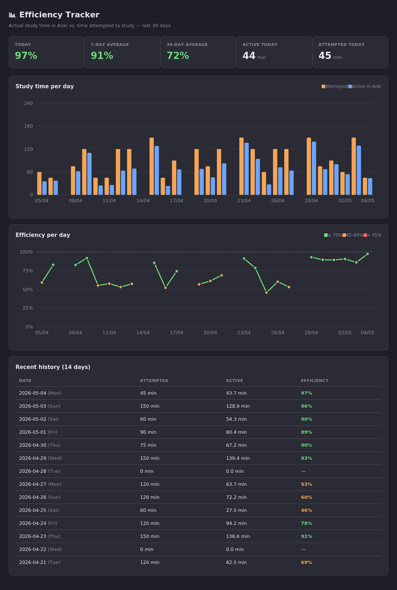
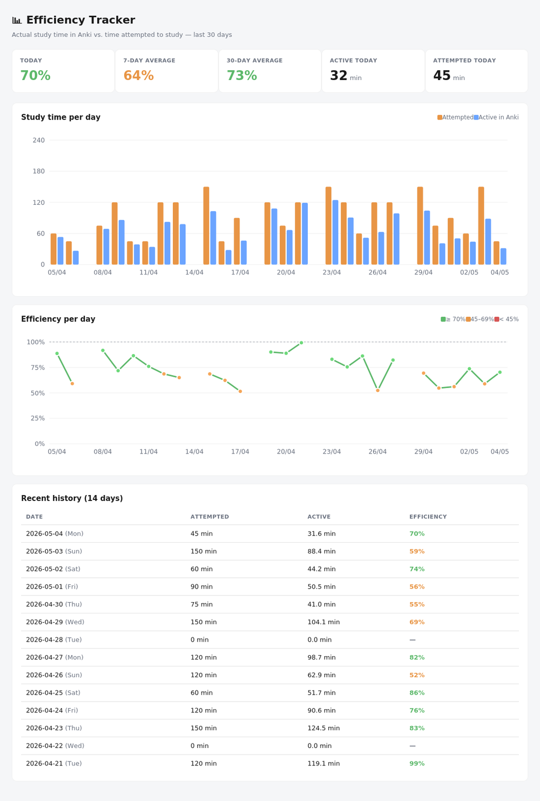

# Efficiency Tracker — Anki add-on

Tracks how **efficiently** you studied: compares your actual study time in
Anki against the time you *attempted* to study, and visualises the history
across the last 30 days.



<details>
<summary>Light mode</summary>



</details>

## What does it do?

Anki already shows how long you actually spent doing reviews. But that isn't
the same as how long you *tried* to study. You may have spent two hours at
your desk, but Anki only counted 45 minutes — the rest was scrolling, getting
distracted, or staring at one card.

This add-on lets you log how much time you attempted to study each day, and
then computes your efficiency:

```
efficiency = actual study time in Anki / time attempted to study
```

The result is a dashboard with a bar chart, a line chart, and a table of
your recent history.

## Features

- ➕ Quick input of attempted study time, with a date picker for back-filling
- 📊 Dashboard with today's efficiency, 7-day average, and 30-day average
- 🔘 Toolbar button right next to Anki's built-in "Stats" — one click to
  open the dashboard
- 📈 Bar chart per day (attempted vs. active in Anki)
- 📉 Line chart of efficiency, colour-coded by threshold (defaults: ≥ 70%
  green, 45–69% amber, < 45% red — fully configurable)
- 🗂️ Table with the last 14 days
- ⌨️ Keyboard shortcuts: `Ctrl+Shift+E` to enter time, `Ctrl+Shift+S` for
  statistics
- 🌓 Theme cycle button in the dashboard (auto / light / dark) — also
  settable via the add-on config
- 📦 Zero external dependencies — all charts in pure SVG, ~6 KB total
- 🔌 Works fully offline

## Installation

### Option 1: from a release file

1. Download the latest `efficiency_tracker.ankiaddon` from the
   [Releases](../../releases) page
2. Open Anki → **Tools → Add-ons → Install from file…**
3. Select the downloaded file
4. Restart Anki

### Option 2: build from source

```bash
git clone https://github.com/sitolam/efficiency-tracker.git
cd efficiency-tracker
./scripts/build.sh
# → produces dist/efficiency_tracker.ankiaddon
```

Then install via **Tools → Add-ons → Install from file…**.

### Option 3: copy manually (for development)

Copy the `src/efficiency_tracker/` folder into your Anki addons directory:

- **macOS**: `~/Library/Application Support/Anki2/addons21/`
- **Windows**: `%APPDATA%\Anki2\addons21\`
- **Linux**: `~/.local/share/Anki2/addons21/`

## Usage

After installing, a new menu **Tools → Efficiency Tracker** appears with
two actions:

| Action                       | Shortcut         | What it does                                                |
|------------------------------|------------------|-------------------------------------------------------------|
| ➕ Enter study time…        | `Ctrl+Shift+E`   | Log how many minutes you attempted to study on a given day  |
| 📊 Show statistics…         | `Ctrl+Shift+S`   | Open the dashboard                                          |

The input dialog has a date picker so you can also back-fill earlier days.
It immediately shows your actual Anki study time for the chosen day, so
you see the resulting efficiency the moment you enter a value.

## Configuration

Open **Tools → Add-ons → Efficiency Tracker → Config** to tune:

| Key | Default | Description |
|-----|---------|-------------|
| `theme` | `"auto"` | `"auto"` (follow system), `"dark"`, or `"light"`. Also cycleable from the dashboard. |
| `good_threshold` | `70` | Efficiency % at which the indicator turns green |
| `warn_threshold` | `45` | Below this %, indicator turns red. Between this and `good_threshold` it's amber |
| `show_toolbar_button` | `true` | Show the "Efficiency" link in Anki's top toolbar (restart Anki after changing) |

## How it works

- **Actual study time** comes straight from Anki's `revlog` table (the same
  data Anki's own statistics use). The day boundary follows your Anki
  rollover setting (4 AM by default).
- **Attempted time** is stored in `user_data.json` inside the add-on
  folder. One file, human-readable JSON, easy to back up or edit by hand.
- **Visualisation** is generated as pure SVG inside an Anki webview. No
  Chart.js, no CDN, no tracking — works offline.

## Compatibility

- Anki 2.1.50+ (Qt6)
- Tested on macOS, Windows, and Linux

## Known limitations

- Statistics always show the last 30 days (configurable range coming).
- No cross-device sync — `user_data.json` stays local. To share across
  machines you can sync the add-on folder via iCloud, Dropbox, etc.

## Contributing

Issues and pull requests are welcome. Some ideas on the roadmap:

- Note field per day (why was efficiency low?)
- Streak counter for consecutive days at ≥ X% efficiency
- Configurable time range (7 / 30 / 90 / 365 days)
- CSV export
- Per-week or per-month efficiency targets

## License

[MIT](LICENSE)
